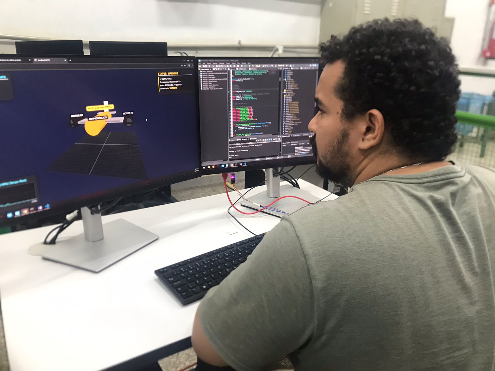
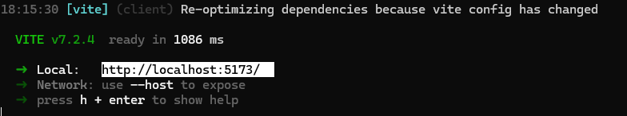

<div style="text-align: center;">
<h2>Diagnóstico Hierárquico para Falhas Aeronáuticas</h2>

</div>


> Este projeto é um protótipo de um sistema de FID (Fault Detection and Identification) para aeronaves.

<style>
.video-wrapper { position: relative; padding-bottom: 56.25%; height: 0; overflow: hidden; }
.video-wrapper iframe { position: absolute; top:0; left:0; width:100%; height:100%; border:0; }
</style>

<div class="video-wrapper">
<iframe src="https://www.youtube.com/watch?v=6BKYYs_KToA" title="YouTube"></iframe>
</div>


Em vez de usar um modelo de IA "monolítico", esta arquitetura usa um total de 14 modelos especialistas (RandomForestClassifier) em uma cascata de 3 níveis. O objetivo é imitar o processo de diagnóstico de um engenheiro de manutenção: começar pelo sistema principal, ir para o subsistema e, finalmente, isolar o componente com falha.

`Nível 1 (Sistema)` → `Nível 2 (Subsistema)` → `Nível 3 (Diagnóstico Específico)`

Exemplo de Diagnostico: `SISTEMAS` → `HIDRÁULICO` → `VAZAMENTO BOMBA DE COMBUSTIVEL B`

## Motivos da utilização de uma arquitetura hierárquica

Um modelo "flat" (plano) que tenta adivinhar 1 de 50 falhas é ineficiente e ignora a relação óbvia entre os sistemas. A abordagem em cascata (conhecida como Local Classifiers Per Node) é mais *precisa*, mais *interpretável*, e *facilmente escalável*.

A arquitetura utiliza modelos especialistas em cascata, nos quais o resultado de um modelo serve de entrada para o próximo nível, garantindo uma análise refinada e interpretável. Cada nível possui modelos especializados, treinados individualmente com técnicas supervisionadas, ajustados para o seu domínio de atuação.

Pode-se dizer que neste projeto possuimos um protótipo de FDI (Fault Detection and Identification). Entretanto temos um conjunto total de 13+ modelos de IA (entre classificadores e filtros de decisão). 

## Estrutura dos Dados

Devido à óbvia confidencialidade dos dados reais de falhas, este projeto roda em um dataset sintético de alta fidelidade gerado pelo script `src/dataset_create.py`

Este gerador cria um "Digital Twin" do voo, produzindo um .csv com 71 features (sensores) e 3 labels (rótulos de diagnóstico).

- Features (X): `sensor_EGT_motor_1`, `sensor_pressao_hidr_A`, `sensor_volt_gerador_1`, etc.
- Labels(y): `nivel1`, `nivel2`, `nivel3`  
 
Devido à **restrição e confidencialidade de dados reais de falhas aeronáuticas**, as informações originais não são publicamente disponíveis. Por isso, foi criada uma **base simulada com 74 parâmetros de sensores** que reproduzem o comportamento de sistemas críticos durante o voo.

Esses parâmetros representam medidas típicas coletadas por sistemas embarcados, incluindo **variáveis ambientais, de navegação, motor, combustível, hidráulico, elétrico e estruturais**.  


**Exemplo de amostra:**

| sensor_temp_externa | sensor_gps_latitude | sensor_gps_longitude | sensor_gps_altitude | sensor_velocidade_gps | sensor_heading_magnetico | sensor_heading_gyro | nivel1 | nivel2 | nivel3 |
|---------------------:|--------------------:|----------------------:|--------------------:|----------------------:|-------------------------:|--------------------:|--------|--------|--------|
| -46.980416 | -23.501459 | -46.607012 | 35220.71 | 449.72 | 93.73 | 87.37 | NORMAL | NORMAL | NORMAL |
| -47.091172 | -23.501421 | -46.625197 | 35507.33 | 453.08 | 88.68 | 90.29 | ESTRUTURAL | FUSELAGEM | DANO POR FADIGA |
| -42.009555 | -23.501841 | -46.611753 | 34777.38 | 456.83 | 92.26 | 90.86 | SISTEMAS | MOTOR | EGT ALTA M2 |


## Organização do projeto

```bash
📁 Diagnostico_Hierarquico/
 ┣ 📁 img/
 ┣ 📁 hardware/
 │  ┣ 📁 front-end/
 │  │   ┣ 📁 fonts
 │  │   ┣ 📁 node_modules
 │  │   ┣ 📄 airplane.json
 │  │   ┣ 📄 index.html
 │  │   ┣ 📄 main.js
 │  │   ┣ 📄 package.json
 │  │   ┗ 📄 package-lock.json
 │  ┗ 📄 conversor.c   
 ┣ 📁 modelo/
 │  ┣ 📁 data/
 │  │  ┣ 📁 processed/               
 │  │  ┗ 📁 raw/                      
 │  │     ┗ 📄 dataset_aircraft_failures.csv
 │  │
 │  ┣ 📁 models/
 │  │  ┣ 📁 nivel1/
 │  │  │  ┗ 📄 modelo_raiz.pkl
 │  │  ┣ 📁 nivel2/
 │  │  │  ┣ 📄 modelo_estrutural.pkl
 │  │  │  ┗ 📄 modelo_sistemas.pkl
 │  │  ┗ 📁 nivel3/
 │  │     ┣ 📄 modelo_asa.pkl
 │  │     ┣ 📄 modelo_avionica.pkl
 │  │     ┣ 📄 modelo_cabine.pkl
 │  │     ┣ 📄 modelo_combustivel.pkl
 │  │     ┣ 📄 modelo_controles_de_voo.pkl
 │  │     ┣ 📄 modelo_eletrico.pkl
 │  │     ┣ 📄 modelo_fuselagem.pkl
 │  │     ┣ 📄 modelo_hidraulico.pkl
 │  │     ┣ 📄 modelo_motor.pkl
 │  │     ┣ 📄 modelo_pneumatico.pkl
 │  │     ┗ 📄 modelo_trem_de_pouso.pkl
 │  │
 │  ┣ 📁 notebooks/
 │  │  ┗ 📄 exploratory_analysis.ipynb
 │  │
 │  ┣ 📁 src/
 │  │  ┣ 📄 dataset_create.py         
 │  │  ┣ 📄 models.py                 
 │  ┗  ┗ 📄 predict.py                
 │
 ┣ 📄 .gitignore
 ┣ 📄 requirements.txt
 ┗ 📄 README.md

```

## Como rodar a pipeline completa

1. Clone e instale o repositório em sua maquina:
    ```Bash
        git clone https://github.com/FernandooFurtado/Diagnostico_Hierarquico.git
    ```
1. Acesse o diretório
   ```Bash
        cd Diagnostico_Hierarquico
   ```
1. Crie um ambiente virtual python
   ```Bash
        python -m venv venv
   ```
1. Ative o ambiente virtual
   ```Bash
       source ./venv/Scripts/activate
   ```
1. Instale o requirements
   ```Bash       
        pip install -r requirements.txt
   ```
1. Gerar o dataset, é uma forma que encontrei para compactar o arquivo, não se preocupe com escalonamento e nem com variáveis do tipo string.
    ```Bash
        python src/generate_dataset.py
    ```

1. Treinar os modelos
    ```Bash
        python src/generate_models.py
    ```

1. Fazer o diagnóstico e testar modelos
    ```
        python src/inference.py
    ```

## Como testar o arquivo do modelo 3D

1. Instale em sua maquina o [node js](https://nodejs.org/pt)
1. Acesse o diretório hardware/front-end
2. Abra o cmd neste diretório
3. Execite o comando serve para permitir que o windows aceite comandos do npm 
   ```
        Set-ExecutionPolicy -Scope Process -ExecutionPolicy Bypass
    ```
4. Rode o servidor
   ```
        npm run dev
   ```
5. Copie o link gerado e abra um navegador e cole-o na URL 
<div style="text-align: center;">

</div>


Como o hardware não está em sua posse, para verificar o funcionamento manipule os parametros do arquio json e veja o resultado, para demonstrar legendas precione a tecla de espaço, a IA nessa versão do front-end não está integrada, afinal sem o hardware não tem o porque utilizar essa versão simplificada.
